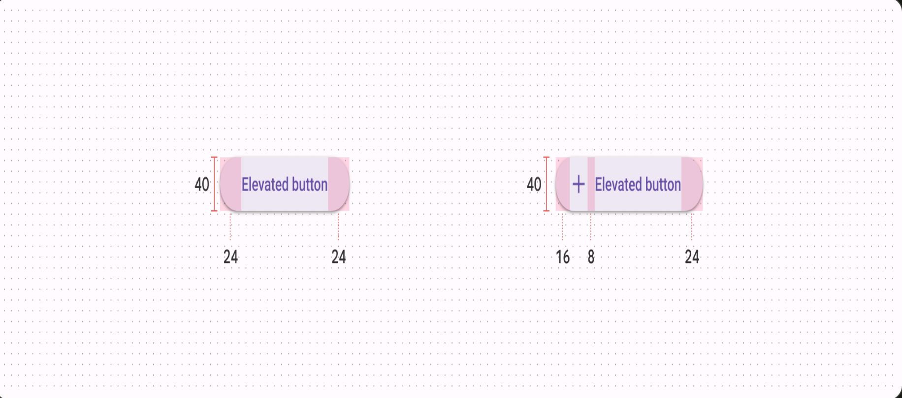

> [English](./CONTRIBUTING.md) | 简体中文

# 贡献指南

一个人跑的很快，一群人跑的更远。我们欢迎任何形式的贡献，包括但不限于以下几种：

* 问题建议
* 完善文档
* 完善示例
* 完善测试
* 完善组件
* 提交 PR
* 参与讨论
* 分享项目
* ...

## 组件开发

我们开始制定组件开发规范，希望能够帮助大家更好的开发组件，我们会不断的完善和优化，欢迎大家提出宝贵的意见和建议。

我们开始使用 [Google Material Design](https://m3.material.io/) 作为组件的设计规范。``` Material Design``` 提供了组件开发的设计标准如大小、间距、颜色、动画等，让我们的组件库有了设计准则。

例如：``` Material Design``` 中的按钮组件，它的设计标准如下：

大小间距：




## 提交 Pull Request

1. Fork [此仓库](https://github.com/tsinghua-lau/fusion-ui)
2. 进入本地项目根目录，使用 `pnpm i` 安装依赖。
3. 使用 `pnpm run docs:dev` 启动项目， 查看文档。
4. 提交前请先```git pull``` 拉取最新代码，以免提交文件冲突。
5. 提交 ```git commit```, 请同时遵守 [Commit 规范](#Commit-指南)。
6. 提交 Pull Request。

## 如何开发一个新的组件

### Commit 指南

以下是 commit 类型列表:

- feat: 新特性或功能
- fix: 缺陷修复
- docs: 文档更新
- style: 代码风格或者组件样式更新
- refactor: 代码重构，不引入新功能和缺陷修复
- perf: 性能优化
- test: 单元测试
- chore: 其他不修改 src 或测试文件的提交

例如：
```
git commit -m 'fix: xxxxx'
git commit -m 'feat: add xxxxx'
git commit -m 'docs: update xxxxx'
```
如果在github还没有提交过pr，也没有关系可以参考一下[这里](https://blog.csdn.net/gentleman_hua/article/details/123816150?ops_request_misc=%257B%2522request%255Fid%2522%253A%2522169199126416800188573391%2522%252C%2522scm%2522%253A%252220140713.130102334.pc%255Fblog.%2522%257D&request_id=169199126416800188573391&biz_id=0&utm_medium=distribute.pc_search_result.none-task-blog-2~blog~first_rank_ecpm_v1~rank_v31_ecpm-1-123816150-null-null.268^v1^koosearch&utm_term=pr&spm=1018.2226.3001.4450)。


## 行为准则

该项目有一份 [行为准则](./CODE_OF_CONDUCT.md)，希望参与项目的贡献者都能严格遵守。

## License

[MIT 协议](./LICENSE).
