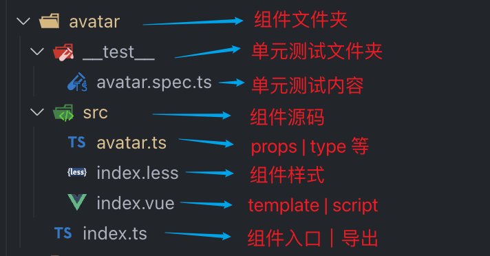
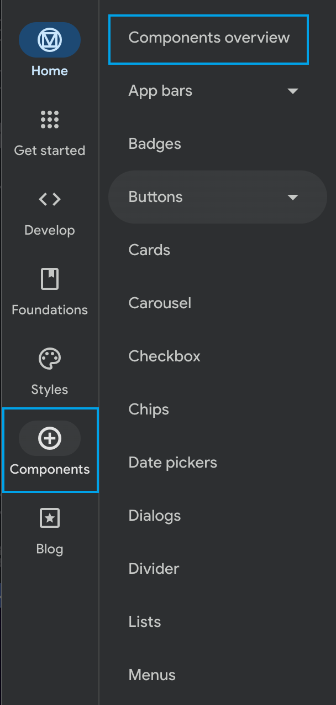
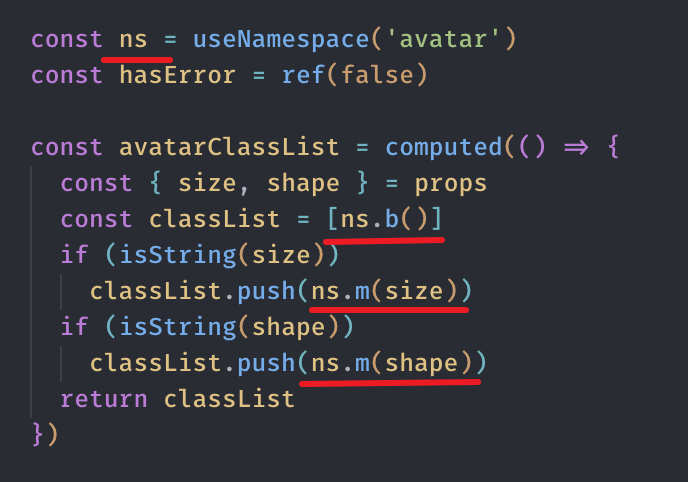
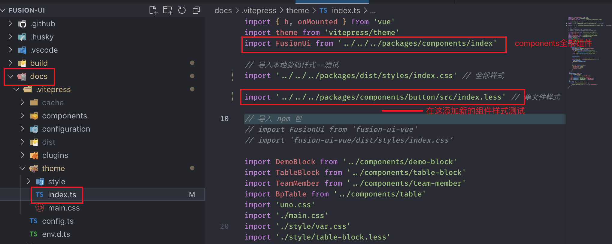
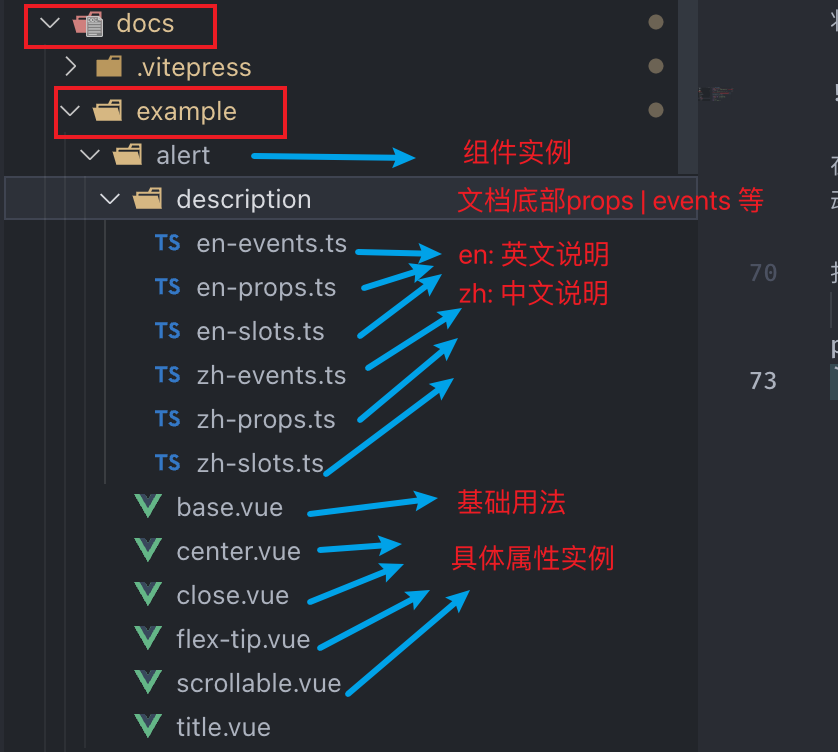
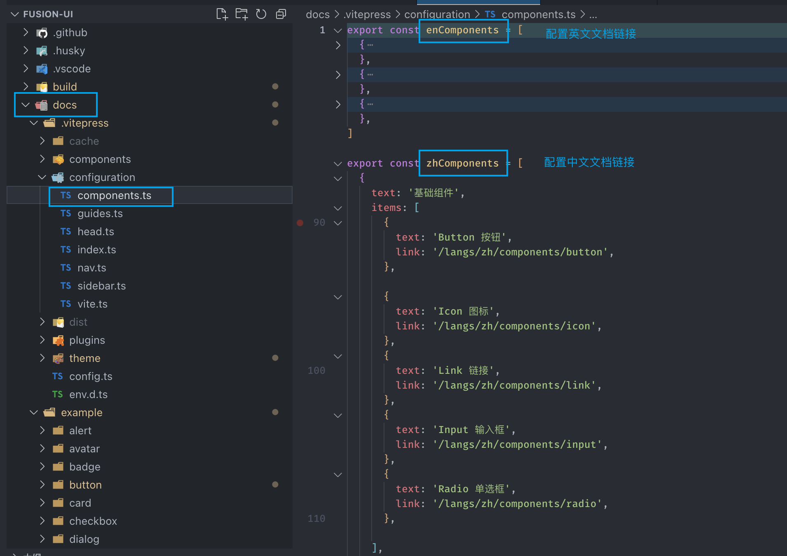

#  🍺 测试组件

## 1. 新建组建

-  在```packages/components```下新建组件文件夹

## 2. 注册组件

-  将你的组件从```packages/index.ts```导出

```main.ts：```

-  导入```packages/components```下的组件样式

例如: button组件


  ```ts
import '@interface-ui/components/button/src/index.less' // 开发调试的样式
  ```

## 3. 启动开始玩耍 🎊

  ```
  pnpm run dev
  ```


# 😋 新组建开发调试


##  组件的目录结构


## 组件的开发规范

我们开始制定组件开发规范，希望能够帮助大家更好的开发组件，我们会不断的完善和优化，欢迎大家提出宝贵的意见和建议。

我们开始使用 [Google Material Design](https://m3.material.io/) 作为组件的设计规范。``` Material Design``` 提供了组件开发的设计标准如尺寸、间距、颜色、动画等，让我们的组件库有了设计准则。

例如：``` Material Design``` 中的按钮组件，它的设计标准如下：

尺寸间距：


链接：https://m3.material.io/components/buttons#specs



可以参考的 [Material Design](https://m3.material.io/) 组件库：
[material-ui](https://mui.com/material-ui/react-button/)

当前组件库参考实现的组件 ```Avatar``` ```Checkbox```

## 组件的编写推荐
我们推荐使用```命名空间```的方式编写组件，例如：



当然，你也可以使用```hooks```的方式编写组件

## 组件集成到 ```DOCS``` 文档

1. 将新的组件导入注册到 ```packages/index.ts``` 中



2. 在 ```docs/.vuepress/config.ts``` 中导入样式

根目录打包生成Docs 依赖的 dist/styles/index.css

```
pnpm run build
```

3. 编写```example``` 实例




4. 编写```md``` 组件描述


5. 配置 Docs 文档路由链接 md 文件生成为html页面



## 启动文档

  ```
  pnpm run docs:dev
  ```
## 🎉 全部流程结束
